# Documentarian: Agentic Documentation Workflows in QA.tech

## What is the Documentarian?

The **Documentarian** is a specialized AI agent role designed to create and maintain user-facing documentation for QA.tech. It operates in a separate repository (`qatech-docs`) and follows a strict code-verification workflow to ensure documentation accuracy.

### Core Purpose

The Documentarian acts as a **code-verified documentation specialist** that:

- Creates minimal, scannable user documentation (50-200 words per section)
- Verifies every claim against the actual codebase
- Follows format priority (Tables > Bullets > Steps > Paragraphs)
- Applies UI Configuration Pattern for form-based features
- Maintains terminology consistency across all docs
- Never assumes existing docs are accurate—code is the source of truth

### Key Principles

1. **Code as Source of Truth**: Never assume existing docs are accurate; verify EVERY claim against code
2. **Verify Constraints in Code**: Find enforcement code (`.eq()` checks, validation logic); document PRIMARY constraints
3. **Never Create Temp Files**: Only commit `.mdx` files and `mint.json`; delete any temp files before commit
4. **User Approval Gates**: STOP before commit and push; get explicit approval at each gate

### Repository Structure

- **Docs Repo**: `/Code/qatech-docs` (Mintlify, auto-deploy from `main`)
- **Code Repo**: `/Code/qatech` (source of truth for verification)
- **Branch**: Always `main` (no feature branches, auto-deploy)
- **Purpose**: Minimal, scannable, code-verified user documentation

## How It Works

The Documentarian operates through a **4-step systematic workflow** that ensures accuracy, consistency, and user-friendliness:

### 1. UNDERSTAND

**Purpose**: Ensure code is the source of truth—verify all claims (existing + new) match actual implementation before writing.

- Read entire target file (if updating existing docs)
- List ALL claims (existing + new) that will be documented
- Verify each claim in code (file:line reference)
- Fix existing inaccuracies first (code wins over docs)
- Then proceed with new content

### 2. PLAN

- List 3-5 customer questions
- Map questions to formats (Table/Bullets/Steps/Q&A)
- Check terminology consistency: `grep -r "term" *.mdx`
- Verify no redundancy exists

### 3. WRITE

- Apply format priority (Tables > Bullets > Steps > Paragraphs)
- Target: 50-200 words/section
- Structure: Intro → Benefits → Setup → Examples → Limitations
- Apply UI Configuration Pattern if form-based
- Embed details in context (no separate sections)

### 4. EXECUTE

- Verify branch: `git branch --show-current` = "main"
- Update `mint.json` if new page
- Preview: `mintlify dev`
- **STOP**: Get user approval (list files, explain changes, ASK, WAIT)
- Stage: `git add specific-file.mdx`
- Commit: descriptive message with ticket ref
- **STOP**: Get push approval (show commit, ASK, WAIT)
- Push: `git push origin main`
- Update: `docs-update-plan.md`

## Workflow Diagram

**Role Switching Logic**: The Documentarian role activates when requests are for user-facing documentation that will be published to docs.qa.tech. Requests for in-app UI text, code comments, or internal docs stay in the Monorepo Agent role and work in the main codebase.

```mermaid
flowchart TD
    Start([Documentation Request]) --> Trigger{Is this user-facing<br/>docs for docs.qa.tech?}
    Trigger -->|No: In-app UI,<br/>code comments,<br/>internal docs| StayMonorepo[Stay in Monorepo Agent<br/>Work in /Code/qatech]
    Trigger -->|Yes: Integration guides,<br/>API references,<br/>customer setup| Switch[Switch to Documentarian<br/>Work in /Code/qatech-docs]

    Switch --> Understand[1. UNDERSTAND<br/>What claims exist<br/>in docs vs code?]
    Understand --> ReadFile{Existing<br/>Doc File?}
    ReadFile -->|Yes| ReadExisting[Read Entire File<br/>Extract ALL Claims]
    ReadFile -->|No| ListNewClaims[List New Claims<br/>to Document]
    ReadExisting --> ListAllClaims[List ALL Claims<br/>Existing + New]
    ListNewClaims --> ListAllClaims

    ListAllClaims --> VerifyCode[Verify Each Claim<br/>Against Code<br/>file:line reference]
    VerifyCode --> FixInaccuracies{Docs Match<br/>Code?}
    FixInaccuracies -->|No: Fix First| FixDocs[Fix Existing<br/>Inaccuracies]
    FixDocs --> VerifyCode
    FixInaccuracies -->|Yes: All Verified| Plan[2. PLAN]

    Plan --> CustomerQuestions[List 3-5 Customer<br/>Questions]
    CustomerQuestions --> MapFormats[Map to Formats<br/>Table/Bullets/Steps/Q&A]
    MapFormats --> CheckTerminology[Check Terminology<br/>Consistency]
    CheckTerminology --> CheckRedundancy[Verify No<br/>Redundancy]
    CheckRedundancy --> Write[3. WRITE]

    Write --> ApplyFormat[Apply Format Priority]
    ApplyFormat --> Structure[Structure: Intro →<br/>Benefits → Setup →<br/>Examples → Limitations]
    Structure --> CheckForm{Form-Based<br/>Feature?}
    CheckForm -->|Yes| UIPattern[Apply UI Config<br/>Pattern]
    CheckForm -->|No| WordCount[Target: 50-200<br/>words/section]
    UIPattern --> WordCount

    WordCount --> Execute[4. EXECUTE]
    Execute --> CheckBranch{Branch =<br/>main?}
    CheckBranch -->|No| SwitchBranch[Switch to main]
    CheckBranch -->|Yes| UpdateMint{New Page?}
    SwitchBranch --> UpdateMint
    UpdateMint -->|Yes| UpdateNav[Update mint.json]
    UpdateMint -->|No| Preview
    UpdateNav --> Preview[Preview: mintlify dev]

    Preview --> Approval1[STOP: Get User<br/>Approval]
    Approval1 --> Stage[Stage Files]
    Stage --> Commit[Commit with<br/>Ticket Ref]
    Commit --> Approval2[STOP: Get Push<br/>Approval]
    Approval2 --> Push[Push to main]
    Push --> UpdatePlan[Update docs-update-plan.md]
    UpdatePlan --> LinearUpdate[Update Linear Ticket]
    LinearUpdate --> End([Docs Live])

    style Start fill:#e1f5ff
    style End fill:#d4edda
    style Trigger fill:#fff3cd
    style FixInaccuracies fill:#fff3cd
    style CheckForm fill:#fff3cd
    style CheckBranch fill:#fff3cd
    style UpdateMint fill:#fff3cd
    style Approval1 fill:#f8d7da
    style Approval2 fill:#f8d7da
    style StayMonorepo fill:#d1ecf1
```



## Example: Documenting File Upload Feature

### Scenario: Document File Upload Configuration

**Linear Ticket**: QAT-4521 - "Document file upload feature for customers"

**Request**: "Update docs to explain how customers can configure custom file uploads for testing"

---

### Step 1: UNDERSTAND

```bash
# Check if file exists
cd /Users/pridiuksson/Code/qatech-docs
ls test-features/file-uploads.mdx
# File exists - read it
cat test-features/file-uploads.mdx
```

**Existing Content Review**:

- ✅ Documents default test files (test.pdf, test.jpg)
- ✅ Documents custom file upload configs
- ⚠️ Missing: File size limit constraint
- ⚠️ Missing: UI Configuration Pattern for form fields
- ⚠️ Missing: Storage provider details

**List ALL Claims to Verify**:

1. Default files: test.pdf, test.jpg available
2. Custom uploads via configs
3. Max file size: 250MB (need to verify)
4. File selector implementation
5. Drag-and-drop not supported
6. File type restrictions handled automatically

**Verify Each Claim in Code**:

```bash
# Find file size limit
cd /Users/pridiuksson/Code/qatech
ripgrep("MAX_FILE_SIZE|250", "apps/saas")
# Found: apps/saas/src/app/(authenticated)/p/[project]/settings/configs/components/forms/FileUploadConfigForm.tsx:37
# const MAX_FILE_SIZE = 1024 * 1024 * 250 // 250 MB
```

**Code Verification Results**:

- ✅ Max file size: 250MB (verified in `FileUploadConfigForm.tsx:37`)
- ✅ Storage provider: Supabase (verified in `useUploadFile.ts:28`)
- ✅ Bucket: `file_uploads` (verified in `useUploadFile.ts:28`)
- ✅ File selector: Custom implementation (verified in docs)
- ✅ Drag-and-drop: Not supported (verified in docs)

**Fix Existing Inaccuracies**: None found—all existing claims verified.

---

### Step 2: PLAN

**Customer Questions**:

1. How do I configure a custom file upload?
2. What's the maximum file size?
3. Where do I upload the file in the UI?
4. What file types are supported?
5. How does the agent use my uploaded file?

**Map Questions to Formats**:

| Question         | Format                   | Location            |
| ---------------- | ------------------------ | ------------------- |
| How to configure | Steps component          | Setup section       |
| Max file size    | Table (Limitations)      | Limitations section |
| Where in UI      | UI Configuration Pattern | Examples section    |
| File types       | Bullets                  | Setup section       |
| Agent usage      | Paragraphs               | Examples section    |

**Check Terminology Consistency**:

```bash
cd /Users/pridiuksson/Code/qatech-docs
grep -r "file upload\|fileUpload\|file-upload" *.mdx
# Check for consistency: use "file upload" (two words)
```

**Verify No Redundancy**: Check if file size limit mentioned elsewhere—not found.

---

### Step 3: WRITE

**Apply Format Priority**:

- Setup: Steps component (action-oriented)
- Limitations: Table (what works vs doesn't)
- Examples: UI Configuration Pattern (form-based)
- File types: Bullets (list)

**Structure**:

1. Intro (what + why)
2. Default Files (existing, keep)
3. Custom File Uploads (expand with UI pattern)
4. Limitations (add file size table)
5. File Type Restrictions (existing, keep)

**Apply UI Configuration Pattern** (for form-based setup):

```mdx
### Example: Upload Custom Test File

Upload a custom file for testing specific import features.

**Fill the form fields:**

| Field           | Enter This                            |
| --------------- | ------------------------------------- |
| **Config Name** | `Invoice Import CSV`                  |
| **File Upload** | Click "Choose File" or drag file here |

**In the File Upload field, select this file:**
```

your-test-file.csv

```

✅ Click **Save**
```

**Write Complete Section** (50-200 words per section):

```mdx
## Custom File Uploads

For testing specific file import features or custom file requirements, create a file upload config.

<Steps>
  <Step title="Navigate to Configs">
    Go to Settings » Configs in your project
  </Step>
  <Step title="Create File Upload Config">
    Select "File Upload" type and click "Create Config"
  </Step>
  <Step title="Upload Your File">
    In the File Upload field, select your test file (max 250MB)
  </Step>
  <Step title="Save Configuration">Enter a config name and click **Save**</Step>
  <Step title="Add to Test Case">
    Edit your test case, add the config under "Settings"
  </Step>
</Steps>

### Example: Upload Custom Test File

Upload a custom file for testing specific import features.

**Fill the form fields:**

| Field           | Enter This                            |
| --------------- | ------------------------------------- |
| **Config Name** | `Invoice Import CSV`                  |
| **File Upload** | Click "Choose File" or drag file here |

**In the File Upload field, select this file:**
```

your-test-file.csv

```

✅ Click **Save**

## Limitations

| Constraint | Limit |
|------------|-------|
| **Maximum file size** | 250MB |
| **Storage provider** | Supabase |
| **Drag and drop** | Not supported (click upload area to trigger selector) |
```

---

### Step 4: EXECUTE

```bash
# Verify branch
cd /Users/pridiuksson/Code/qatech-docs
git branch --show-current
# Should output: main

# Update file
# (Edit test-features/file-uploads.mdx with new content)

# Preview locally
mintlify dev
# Opens on http://localhost:6005 (or next available port)
# Verify: Navigation works, formatting correct, no errors
```

**STOP: Get User Approval**

```
Files to update:
- test-features/file-uploads.mdx

Changes:
- Added UI Configuration Pattern example for file upload form
- Added Limitations table with verified 250MB constraint
- Expanded Setup section with Steps component
- Verified all claims against code (FileUploadConfigForm.tsx:37)

Ready to commit? (Y/n)
```

**After Approval**:

```bash
# Stage specific file
git add test-features/file-uploads.mdx

# Commit with ticket reference
git commit -m "docs: expand file upload config documentation (QAT-4521)

- Add UI Configuration Pattern example for form fields
- Add Limitations table with verified 250MB constraint
- Expand Setup section with Steps component
- Verify all claims against code implementation

Refs QAT-4521"
```

**STOP: Get Push Approval**

```
Commit ready:
docs: expand file upload config documentation (QAT-4521)

- Add UI Configuration Pattern example for form fields
- Add Limitations table with verified 250MB constraint
- Expand Setup section with Steps component
- Verify all claims against code implementation

Ready to push to main? (Y/n)
```

**After Approval**:

```bash
# Push to main (auto-deploys)
git push origin main

# Update task tracking
# Edit docs-update-plan.md, move task to ✅ Completed section
```

**Update Linear Ticket**:

```typescript
await mcp_Linear_create_comment({
  issueId: 'QAT-4521',
  body: `✅ **Documentation Complete**

**URL**: https://docs.qa.tech/test-features/file-uploads
**Status**: Live (auto-deployed from main)

**Changes**:
- Added UI Configuration Pattern example for file upload form
- Added Limitations table with verified 250MB constraint (verified in code: \`FileUploadConfigForm.tsx:37\`)
- Expanded Setup section with Steps component
- Verified all claims against codebase

**Verification**:
- ✅ All claims verified in code
- ✅ Format priority applied (Tables > Steps > Bullets)
- ✅ UI Configuration Pattern applied for form fields
- ✅ Terminology consistent across docs
- ✅ Preview tested locally`,
})

await mcp_Linear_update_issue({
  id: 'QAT-4521',
  state: 'Done',
})
```

---

## Key Benefits

1. **Code-Verified Accuracy**: Every claim verified against actual implementation
2. **Consistent Formatting**: Format priority ensures scannable, user-friendly docs
3. **UI Configuration Pattern**: Explicit "where" instructions for form-based features
4. **Terminology Consistency**: Grep checks ensure consistent language across docs
5. **No Redundancy**: Systematic checks prevent duplicate information
6. **User Approval Gates**: Prevents accidental deployments and ensures quality
7. **Auto-Deploy**: Push to main automatically deploys to docs.qa.tech

## Critical Rules Summary

1. **Code as Source of Truth**: Verify EVERY claim (existing + new) against code
2. **Verify Constraints**: Find enforcement code; document PRIMARY constraints only
3. **No Temp Files**: Only commit `.mdx` files and `mint.json`
4. **User Approval**: STOP before commit and push; get explicit approval

## Format Priority Matrix

| Question Type         | Format          | Example                            |
| --------------------- | --------------- | ---------------------------------- |
| What works vs doesn't | Table           | Supported \| Not Supported         |
| How to do X           | Steps component | `<Steps><Step>...</Step></Steps>`  |
| List of items         | Bullets         | `- Item 1\n- Item 2`               |
| Troubleshooting       | Q&A             | **Problem:** ... **Solution:** ... |
| Narrative             | Paragraphs      | Last resort, 1-2 sentences max     |

## UI Configuration Pattern

**For form-based features**, always specify WHERE:

````markdown
**In the [element type] field, [action verb] this [content type]:**

```code
content to paste
```
````

```

**Rules**:
1. Name element type: "textarea", "dropdown", "text field", "checkbox"
2. Use action verbs: "paste", "select", "enter", "click"
3. Tables for multi-field forms
4. Label ALL code blocks with destination
5. State obvious: "Click **Save**" not "save config"

---

*This workflow ensures accurate, scannable, and user-friendly documentation that customers can trust.*

```
