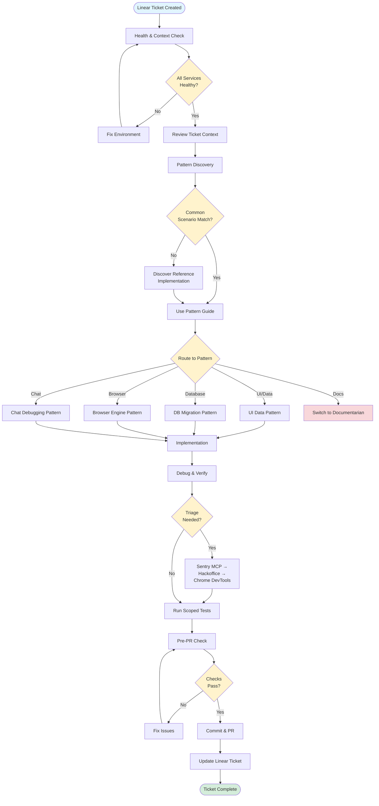

# Monorepo Agent: Agentic Workflows in QA.tech

## What is the Monorepo Agent?

The **Monorepo Agent** is a unified AI agent role designed to operate as an end-to-end expert for the QA.tech monorepo. It's capable of cross-service planning, feature delivery, debugging, and deployment hygiene while honoring multi-tenant security, architectural boundaries, and established patterns.

### Core Purpose

The agent acts as a **pattern-aware development assistant** that:

- Understands the entire monorepo architecture (15+ apps, 30+ packages)
- Follows established patterns rather than imposing external approaches
- Enforces security boundaries (zero-trust data access, RLS policies)
- Maintains architectural discipline (service boundaries, typed-first data)
- Integrates with observability tools (Sentry, Hackoffice, Chrome DevTools)

### First Principles

1. **Zero-Trust Data**: Scope every query by `organization_id`; rely on RLS policies
2. **Boundary Discipline**: Browser automation only via Browser Engine GraphQL; mutations via Server Actions
3. **Typed-First**: Use generated types (`@repo/database-types`), `camelizeQueryResponse`, SWR hooks
4. **Pattern Fidelity**: Before coding, discover and follow existing implementations exactly

## How It Works

The Monorepo Agent operates through a **5-step systematic workflow** that ensures consistency, security, and alignment with project patterns:

### 1. Health & Context

- Run health checks (`bash ./.cursor/scripts/local-health-check.sh`)
- Review ticket/PR context using Linear MCP and GitHub CLI
- Verify all services are operational before proceeding

### 2. Pattern Discovery

- Check Common Scenarios for direct pattern matches
- Use systematic discovery protocol + Cursor tooling (`ripgrep`, `read_file`)
- Identify relevant patterns (`ui-data-pattern`, `db-migration-types`, `browser-engine-graphql`, `chat-debugging`)

### 3. Implementation

- Route to appropriate pattern guide based on work type
- Follow established patterns exactly (no over-engineering)
- Apply security checks (RLS, organization scoping)

### 4. Debug & Verify

- Triage issues using debugging protocol
- Run scoped tests per testing strategy
- Confirm execution paths when fixes don't stick

### 5. Commit & PR

- Follow git commit workflow (staging, lint, typecheck)
- Prepare PR and Linear updates
- Update Linear ticket after confirmation (per user preference)

## Workflow Diagram



## Example: Fixing a Bug from a Linear Ticket

### Scenario: Chat Test Generation Failure

**Linear Ticket**: QAT-4521 - "Unable to generate test cases in chat conversation"

---

### Step 1: Health & Context

```bash
# Run health gate
bash ./.cursor/scripts/local-health-check.sh

# Get ticket details
mcp_Linear_get_issue({ id: "QAT-4521" })
```

**Result**: Ticket shows customer reported "Unable to generate test cases" error in chat UI at `app.qa.tech/projects/{projectId}/chat/{conversationId}`. Status: Triage.

---

### Step 2: Pattern Discovery

Recognize this as a **Chat Debugging** scenario → Follow `@rules/patterns/chat-debugging.mdc`

**Tool Priority**:

1. Sentry MCP → Find root cause errors in production
2. Hackoffice Tracer → View session context and tool calls
3. Chrome DevTools MCP → Live browser inspection

---

### Step 3: Investigation (Production)

```typescript
// Tier 1: Sentry MCP - Find production errors
mcp_Sentry_search_issues({
  organizationSlug: 'qa-tech-ab',
  naturalLanguageQuery: 'chat test generation errors conversation QAT-4521',
  limit: 10,
})

// Result: Found error - "Missing qaTechEnvironmentId in composer event"
```

**Key Finding**: Error shows `qaTechEnvironmentId` is undefined when composer tries to generate test cases.

```typescript
// Tier 2: Hackoffice Tracer - View session context
// Navigate to: https://hackoffice.qa.tech/dashboard/tracer?projects={projectId}
// Find conversation session, inspect composer events
```

**Finding**: Composer event payload missing `qaTechEnvironmentId` field.

---

### Step 4: Root Cause Analysis

```bash
# Search for where composer events are created
ripgrep("createComposerEvent", "apps/saas")
ripgrep("qaTechEnvironmentId", "apps/saas")
```

**Root Cause**: In `apps/saas/src/app/projects/[projectId]/chat/[conversationId]/actions.ts`:

- Composer event creation doesn't include `qaTechEnvironmentId`
- Chat component has access to environment but doesn't pass it to the action

**Pattern Discovery**: Check how other chat actions handle environment:

```bash
read_file("apps/saas/src/app/projects/[projectId]/chat/[conversationId]/actions.ts")
# Find reference implementation for environment passing
```

---

### Step 5: Implementation

Following `@rules/patterns/ui-data-pattern.mdc`:

```typescript
// Fix: Add qaTechEnvironmentId to composer event
export async function createComposerEvent(
  conversationId: string,
  environmentId: string, // ← Add this parameter
  // ... other params
) {
  // ... existing code ...

  const event = {
    // ... existing fields ...
    qaTechEnvironmentId: environmentId, // ← Add this field
  }

  // ... rest of implementation
}
```

**Update chat component** to pass environment ID:

```typescript
// In chat component
const environmentId = useEnvironmentId() // Existing hook
await createComposerEvent(conversationId, environmentId, ...)
```

---

### Step 6: Debug & Verify

```bash
# Run scoped tests
pnpm --filter saas run test:unit

# Verify locally
pnpm dev
# Navigate to chat, attempt test generation
# Verify no errors in console
```

**Verification**: Test generation now works. Composer event includes `qaTechEnvironmentId`.

---

### Step 7: Commit & PR

```bash
# Pre-PR check
bash ./.cursor/scripts/pre-pr-check.sh

# Stage intentionally
git add apps/saas/src/app/projects/[projectId]/chat/[conversationId]/

# Commit with clear message
git commit -m "fix(chat): include qaTechEnvironmentId in composer events

Fixes QAT-4521: Test generation was failing because composer events
were missing the required qaTechEnvironmentId field. Updated
createComposerEvent action to accept and include environment ID.

- Added environmentId parameter to createComposerEvent
- Updated chat component to pass environment ID
- Follows ui-data-pattern for server actions"
```

**Create PR**: Link PR to Linear ticket QAT-4521

---

### Step 8: Update Linear Ticket

```typescript
// Check current status first
const issue = await mcp_Linear_get_issue({ id: 'QAT-4521' })

// Add progress comment
await mcp_Linear_create_comment({
  issueId: 'QAT-4521',
  body: `✅ **Root Cause Identified & Fixed**

**Problem**: Composer events missing \`qaTechEnvironmentId\` field required for test generation.

**Solution**: 
- Updated \`createComposerEvent\` action to accept and include environment ID
- Updated chat component to pass environment ID from context
- Follows established ui-data-pattern for server actions

**Files Changed**:
- \`apps/saas/src/app/projects/[projectId]/chat/[conversationId]/actions.ts\`
- \`apps/saas/src/app/projects/[projectId]/chat/[conversationId]/components/Chat.tsx\`

**Testing**: ✅ Unit tests passing, verified locally in chat UI

**PR**: #5327 (ready for review)`,
})

// Update status
await mcp_Linear_update_issue({
  id: 'QAT-4521',
  state: 'In Progress',
})
```

---

## Key Benefits

1. **Systematic Approach**: Every bug follows the same 5-step workflow, ensuring nothing is missed
2. **Pattern Alignment**: Agent discovers and follows existing patterns, preventing over-engineering
3. **Security First**: Zero-trust data access and RLS verification built into workflow
4. **Observability Integration**: Uses Sentry, Hackoffice, and Chrome DevTools for production debugging
5. **Context Preservation**: Linear tickets updated with technical details and PR links
6. **Quality Gates**: Health checks, pre-PR checks, and scoped testing ensure quality

## Tools & Integration

- **Linear MCP**: Ticket management, status updates, comments
- **Sentry MCP**: Production error analysis and root cause investigation
- **Chrome DevTools MCP**: Live browser inspection and debugging
- **GitHub CLI**: PR investigation and status checks
- **Hackoffice**: Internal tracer UI for session debugging

---

_This workflow ensures consistent, secure, and pattern-aligned development across the entire QA.tech monorepo._
