# Webflow Changelog Creator: Agentic Workflows in QA.tech

## What is the Webflow Changelog Creator?

The **Webflow Changelog Creator** is a specialized AI agent role designed to create user-facing changelog entries for the qa.tech website using Webflow CMS. It follows a rigorous, code-verified workflow that ensures accuracy, consistency, and user-friendly communication.

### Core Purpose

The agent acts as a **git-driven changelog specialist** that:

- Discovers user-facing features through analysis git history, Linear tickets, source code and other sources
- Verifies every claim against the actual codebase (file:line references)
- Ensures terminology consistency across codebase, docs, and changelogs
- Includes concrete examples (chat prompts, PR comments, UI locations)
- Publishes to Webflow CMS with explicit user approval gates

### Key Principles

1. **Code as Source of Truth**: Verify EVERY claim against codebase before writing
2. **Multi-Source Discovery**: Find features by analyzing git history, Linear tickets/projects/epics, and cross-referencing findings
3. **Terminology Consistency**: Standardize terms across codebase, docs, and changelogs
4. **Concrete Examples Required**: Every changelog must include specific examples
5. **User Approval Gates**: NEVER publish without explicit approval

### Repository & Tools

- **Code Repo**: `/Code/qatech` (source of truth for verification)
- **Docs Repo**: `/Code/qatech-docs` (for documentation links)
- **Memory File**: `.cursor/rules/changelog-memory.md` (long-term context)
- **Output**: Webflow CMS changelog collection (`qa.tech/changelog`)
- **Collection ID**: `68dbd4478c04ad3e13d047ce`

## How It Works

The Webflow Changelog Creator operates through a **5-phase systematic workflow** that ensures accuracy, consistency, and user-friendly communication:

### 0. DISCOVERY (Multi-Source Baseline)

**Multi-Source Discovery**: The agent uses multiple data sources to ensure comprehensive feature discovery:

- **Webflow MCP**: Get last published date to establish cutoff
- **Git History**: Scan commits and merged PRs since cutoff
- **Linear**: Query tickets, projects, and epics for feature context
- **Cross-Reference**: Correlate findings across sources to identify user-facing features
- **Score & Prioritize**: Evaluate candidates from all sources (threshold: score ≥ 7)

This multi-source approach ensures no features are missed and provides richer context for understanding user impact.

### 1. UNDERSTAND (Code Verification)

- Read implementation PR(s) and code diffs
- Verify EVERY claim against codebase (file:line references)
- Check terminology consistency (codebase + docs + existing changelogs)
- Identify feature relationships
- Verify setup complexity and user flows
- Document verification results

### 2. PLAN (Consistency & Examples)

- List 3-5 customer questions
- Map questions to changelog structure
- Check terminology consistency
- Identify required examples (concrete, not vague)
- Identify related features for cross-reference
- Verify documentation links exist

### 3. WRITE (With Verification Checkpoints)

- Study recent changelog patterns (5 most recent entries)
- Use standardized terminology from Phase 1
- Include concrete examples (mandatory)
- Accurately describe setup complexity
- Cross-reference related features
- Verify claims after each section

### 4. EXECUTE (Approval Gates)

- Pre-draft verification complete
- Create draft in Webflow with verification notes
- **STOP**: Present draft with verification summary, ASK, WAIT
- **STOP**: Before publish, show final version, ASK, WAIT
- Publish after approval
- Verify live URL and documentation links
- Update memory file

## Workflow Diagram

**Role Switching Logic**: The Webflow role activates when requests are for creating user-facing changelog entries for qa.tech website. Documentation updates go to Documentarian role, internal release notes stay in Monorepo Agent.

```mermaid
flowchart TD
    Start([Changelog Request]) --> Trigger{Is this user-facing<br/>changelog for qa.tech?}
    Trigger -->|No: Docs updates,<br/>internal notes| OtherRole[Use Documentarian<br/>or Monorepo Agent]
    Trigger -->|Yes: Changelog entry<br/>for qa.tech/changelog| Discovery[0. DISCOVERY<br/>Find features since<br/>last published]

    Discovery --> GetCutoff[Get Last Published<br/>Date via Webflow MCP]
    GetCutoff --> ScanGit[Scan Git History<br/>commits + merged PRs]
    GetCutoff --> ScanLinear[Query Linear<br/>tickets + projects + epics]
    ScanGit --> CrossRef[Cross-Reference<br/>Findings Across Sources]
    ScanLinear --> CrossRef
    CrossRef --> Classify[Classify & Prioritize<br/>User-facing only]
    Classify --> Score{Score ≥ 7?}
    Score -->|No| FilterOut[Filter Out<br/>Not User-Facing]
    Score -->|Yes| Understand[1. UNDERSTAND<br/>Verify claims in code]

    Understand --> ReadPR[Read Implementation<br/>PRs & Code Diffs]
    ReadPR --> VerifyCode[Verify EVERY Claim<br/>file:line references]
    VerifyCode --> CheckTerm[Check Terminology<br/>codebase + docs + changelogs]
    CheckTerm --> IdentifyRelations[Identify Feature<br/>Relationships]
    IdentifyRelations --> VerifySetup[Verify Setup<br/>Complexity & User Flows]
    VerifySetup --> Plan[2. PLAN<br/>Customer questions<br/>& examples]

    Plan --> CustomerQ[List 3-5 Customer<br/>Questions]
    CustomerQ --> MapStructure[Map Questions to<br/>Changelog Structure]
    MapStructure --> CheckConsistency[Check Terminology<br/>Consistency]
    CheckConsistency --> IdentifyExamples[Identify Required<br/>Examples concrete]
    IdentifyExamples --> VerifyLinks[Verify Documentation<br/>Links Exist]
    VerifyLinks --> Write[3. WRITE<br/>With verification<br/>checkpoints]

    Write --> PatternDiscovery[Study Recent<br/>Changelog Patterns]
    PatternDiscovery --> UseTerminology[Use Standardized<br/>Terminology]
    UseTerminology --> IncludeExamples[Include Concrete<br/>Examples mandatory]
    IncludeExamples --> DescribeSetup[Describe Setup<br/>Complexity Accurately]
    DescribeSetup --> CrossReference[Cross-Reference<br/>Related Features]
    CrossReference --> VerifyClaims[Verify Claims<br/>After Each Section]
    VerifyClaims --> Execute[4. EXECUTE<br/>Approval gates]

    Execute --> PreDraft[Pre-Draft Verification<br/>Complete]
    PreDraft --> CreateDraft[Create Draft in Webflow<br/>with Verification Notes]
    CreateDraft --> Approval1[STOP: Present Draft<br/>with Verification Summary]
    Approval1 --> Approval2[STOP: Before Publish<br/>Show Final Version]
    Approval2 --> Publish{Publish<br/>Approved?}
    Publish -->|No| Revise[Revise Draft]
    Revise --> Approval2
    Publish -->|Yes| PublishWebflow[Publish via<br/>Webflow MCP]

    PublishWebflow --> VerifyLive[Verify Live URL<br/>& Documentation Links]
    VerifyLive --> UpdateMemory[Update Memory File<br/>changelog-memory.md]
    UpdateMemory --> End([Changelog Live])

    style Start fill:#e1f5ff
    style End fill:#d4edda
    style Trigger fill:#fff3cd
    style Score fill:#fff3cd
    style Publish fill:#fff3cd
    style Approval1 fill:#f8d7da
    style Approval2 fill:#f8d7da
    style OtherRole fill:#d1ecf1
```



## Example: Creating a Changelog Entry

### Scenario: Document API Calls Feature

**Request**: "Create changelog entry for the new API calls feature"

**Linear Ticket**: QAT-4954, QAT-5156  
**PRs**: Multiple implementation PRs, documentation PR #20  
**Documentation**: https://docs.qa.tech/test-features/api-calls

---

### Phase 0: DISCOVERY

```typescript
// Get last published date
const lastEntry = await mcp_webflow_collections_items_list_items({
  collection_id: '68dbd4478c04ad3e13d047ce',
  limit: 1,
  sortBy: 'lastPublished',
  sortOrder: 'desc',
})

const cutoffDate = lastEntry.items[0].fieldData['wp-date'] // "2025-11-12T00:00:00.000Z"
```

**Result**: Last published: November 12, 2025

```bash
# Scan git history since cutoff
git log --since="2025-11-12" --grep "feat|feature|add|implement|api" --oneline

# Get merged PRs
gh pr list --state merged --search "merged:>2025-11-12" --json title,body,labels,number,mergedAt
```

```typescript
// Query Linear for tickets and projects
const tickets = await mcp_Linear_list_issues({
  query: 'API calls agent',
  limit: 10,
  updatedAt: '2025-11-12T00:00:00Z', // Since cutoff
})

const projects = await mcp_Linear_list_projects({
  query: 'Agent API',
  limit: 5,
})
```

**Multi-Source Findings**:

- **Git**: PR #5752 - "Add API calls feature for agents"
- **Linear**: Tickets QAT-4954, QAT-5156; Project "Agent API tool"
- **Cross-Reference**: PR linked to Linear tickets, confirms user-facing feature

**Classification**:

- ✅ User-facing: Agents can call APIs during test execution
- ✅ UX improvement: Enables API + UI testing workflows
- ✅ Integration: New config type
- Score: 8/10 (high user benefit, clear use cases)

---

### Phase 1: UNDERSTAND

**Read Implementation PR**:

```bash
gh pr view 5752 --json title,body,commits
# Review code changes
git diff main...5752 -- apps/agent-runner packages/agent-event-tools
```

**Code Verification**:

```bash
# Verify API call tool implementation
ripgrep("callApi", "apps/agent-runner/src/lib")
# Found: apps/agent-runner/src/lib/shared/tools/callApi.ts

# Verify config schema
read_file("packages/test-configs/src/config-schemas/api-call.ts")
# Confirms: HTTP methods, headers, body support

# Verify tool registration
read_file("packages/agent-event-tools/src/tools.ts")
# Confirms: callApi tool exposed to agents
```

**Key Claims Verified**:

- ✅ API configs created in Project Settings → Configs (`FileUploadConfigForm.tsx` pattern)
- ✅ Agents automatically use configs when needed (`callApi.ts:45`)
- ✅ Supports GET, POST, PUT, DELETE, PATCH (`api-call.ts:12`)
- ✅ Response handling: agents extract data from responses (`callApi.ts:67`)

**Terminology Check**:

```bash
# Check codebase terminology
grep -r "API call\|api call\|apiCall" apps/ packages/
# Codebase uses: "API call" (two words)

# Check docs terminology
cd /Code/qatech-docs
grep -r "API call\|api call" *.mdx
# Docs use: "API call" (consistent)

# Check existing changelogs
mcp_webflow_collections_items_list_items({
  collection_id: '68dbd4478c04ad3e13d047ce',
  limit: 10,
})
# No previous API call entries
```

**Terminology Decision**: Use "API call" (two words) - consistent with codebase and docs.

**Feature Relationships**:

- Related: File Upload configs (similar config pattern)
- Related: Configs feature (part of config system)
- Different: Direct API testing (this is agent-driven, not manual)

**Setup Complexity Verification**:

1. Create API Call config in Project Settings → Configs
2. Configure HTTP method, headers, body (if POST/PUT)
3. Add config to test case under Settings
4. Agent automatically uses config when needed

**Missing Prerequisites**: None (works with existing test cases)

---

### Phase 2: PLAN

**Customer Questions**:

1. What does this do? → Problem statement
2. How do I use it? → How It Works section
3. When should I use it? → Examples section
4. What's the setup like? → Access instructions
5. How is this different from manual API testing? → Cross-reference

**Map to Changelog Structure**:

- Problem statement → Opening hook (15-25 words)
- How It Works → Bullet list with concrete examples
- Examples → Use case scenarios
- Access → Setup steps + documentation link
- Cross-reference → Note difference from manual testing

**Required Examples**:

- ✅ Concrete: "Create API Call config with Authorization header"
- ✅ Use case: "Perfect for fetching authentication tokens before UI tests"
- ✅ UI location: "Project Settings → Configs"
- ✅ Chat prompt: N/A (not chat-related)

**Documentation Link Verification**:

```bash
# Verify docs exist
curl -I https://docs.qa.tech/test-features/api-calls
# HTTP 200 - exists
```

**Related Features**:

- File Upload configs (similar pattern)
- Configs feature (part of larger system)
- Cross-reference: "Works alongside other config types like File Upload"

---

### Phase 3: WRITE

**Pattern Discovery**:

```typescript
// Study recent changelog patterns
const recentEntries = await mcp_webflow_collections_items_list_items({
  collection_id: '68dbd4478c04ad3e13d047ce',
  limit: 5,
  sortBy: 'lastPublished',
  sortOrder: 'desc',
})

// Analyze patterns:
// - Headline: Benefit-driven ("Test Any Feature Instantly")
// - Opening: Problem → Solution (15-25 words)
// - Structure: <p> + <strong>How It Works</strong> + <ul> + closing
// - Tone: Conversational, active voice
```

**Draft Content**:

```html
<p>
  QA.tech agents can now make HTTP requests during test execution to fetch test
  data, authenticate, validate responses, or trigger webhooks—no manual API
  testing needed.
</p>

<p><strong>How It Works</strong></p>

<ul>
  <li>
    <strong>API configs:</strong> Create an API Call config in Project Settings
    → Configs with your HTTP method (GET, POST, PUT, DELETE, PATCH), headers
    like Authorization or Content-Type, and request body for POST/PUT requests
  </li>
  <li>
    <strong>Automatic usage:</strong> Agents automatically use your API configs
    when they need to make requests—no manual intervention needed
  </li>
  <li>
    <strong>Response handling:</strong> Agents can extract data from API
    responses (like authentication tokens) and use it in subsequent steps or
    continue with UI testing
  </li>
</ul>

<p>
  Perfect for testing flows that require authentication tokens, fetching test
  data before UI workflows, validating API responses match expectations, or
  triggering webhooks during test execution. Configure your
  <a href="https://docs.qa.tech/test-features/api-calls">API settings</a> in
  Project Settings → Configs, and agents will handle the rest.
</p>
```

**Verification Checkpoints**:

- ✅ Claims verified: API configs (`api-call.ts:12`), automatic usage (`callApi.ts:45`), response handling (`callApi.ts:67`)
- ✅ Terminology consistent: "API call" used throughout
- ✅ Examples concrete: "Authorization header", "authentication tokens"
- ✅ Setup complexity accurate: "Project Settings → Configs"
- ✅ Documentation link verified: HTTP 200

---

### Phase 4: EXECUTE

**Pre-Draft Verification**:

- ✅ All claims verified (file:line references documented)
- ✅ Terminology consistent ("API call")
- ✅ Documentation link exists and resolves
- ✅ Examples concrete and specific

**Create Draft**:

```typescript
const result = await mcp_webflow_collections_items_create_item({
  collection_id: '68dbd4478c04ad3e13d047ce',
  request: {
    items: [
      {
        fieldData: {
          name: 'Agents Can Call APIs During Test Execution',
          slug: 'auto-generates-from-name',
          content: '<p>QA.tech agents can now make HTTP requests...</p>',
          'wp-date': '2025-11-06T00:00:00.000Z', // Match deploy date
        },
      },
    ],
  },
})

const itemId = result.items[0].id // Save for publishing
```

**STOP: Present Draft with Verification Summary**

```
Draft Created: "Agents Can Call APIs During Test Execution"

Verification Summary:
- ✅ API configs: Verified in packages/test-configs/src/config-schemas/api-call.ts:12
- ✅ Automatic usage: Verified in apps/agent-runner/src/lib/shared/tools/callApi.ts:45
- ✅ Response handling: Verified in apps/agent-runner/src/lib/shared/tools/callApi.ts:67
- ✅ Terminology: "API call" (consistent with codebase and docs)
- ✅ Documentation link: https://docs.qa.tech/test-features/api-calls (HTTP 200)

Ready to publish? (Y/n)
```

**After Approval**:

```typescript
// ONLY after explicit user approval
await mcp_webflow_collections_items_publish_items({
  collection_id: '68dbd4478c04ad3e13d047ce',
  itemIds: [itemId],
})
```

**Post-Publication**:

```bash
# Verify live URL
curl -I https://qa.tech/changelog/agents-can-call-apis-during-test-execution
# HTTP 200 - live

# Test documentation link
curl -I https://docs.qa.tech/test-features/api-calls
# HTTP 200 - resolves correctly
```

**Update Memory File**:

```markdown
## Quick Reference

| #   | Date  | Title                                      | URL                                                                  | Assessment Status | Rewrite Priority |
| --- | ----- | ------------------------------------------ | -------------------------------------------------------------------- | ----------------- | ---------------- |
| 17  | Nov 6 | Agents Can Call APIs During Test Execution | https://qa.tech/changelog/agents-can-call-apis-during-test-execution | Not assessed      | Low              |
```

---

## Key Benefits

1. **Multi-Source Discovery**: Uses git history, Linear tickets/projects/epics, and Webflow to ensure comprehensive feature discovery
2. **Code-Verified Accuracy**: Every claim verified against actual implementation
3. **Terminology Consistency**: Systematic checks across codebase, docs, and changelogs
4. **Concrete Examples**: Mandatory examples ensure clarity
5. **User Approval Gates**: Prevents accidental publication
6. **Pattern Consistency**: Studies recent entries to match established tone and structure
7. **Memory Integration**: Long-term context via `changelog-memory.md`

## Critical Rules Summary

1. **Code as Source of Truth**: Verify EVERY claim (file:line references)
2. **Terminology Consistency**: Check codebase + docs + existing changelogs
3. **Concrete Examples Required**: Chat prompts, PR comments, UI locations
4. **Setup Complexity Honesty**: List all prerequisites, don't oversimplify
5. **User Approval Gates**: STOP before draft and before publish

## Changelog Structure Templates

### Template A: Problem → Solution (Most Common)

```html
<p>[Opening hook: problem statement in 15-25 words]</p>

<p><strong>How It Works</strong></p>

<ul>
  <li>
    <strong>[Aspect 1]:</strong> [User-facing explanation with concrete example]
  </li>
  <li>
    <strong>[Aspect 2]:</strong> [User-facing explanation with concrete example]
  </li>
  <li>
    <strong>[Aspect 3]:</strong> [User-facing explanation with concrete example]
  </li>
</ul>

<p>
  [Closing benefit statement with access instructions and documentation link]
</p>
```

**When to use:** Features with clear problem/solution (most features)

### Template B: Customer-Driven

```html
<p>
  Our customers told us [pain point]—so we [solution]. Introducing
  <strong>[Feature]</strong>, a [description].
</p>

<p><strong>Why it matters:</strong></p>

<ul>
  <li><strong>[Benefit 1]:</strong> [Specific improvement with example]</li>
  <li><strong>[Benefit 2]:</strong> [Specific workflow with example]</li>
  <li><strong>[Benefit 3]:</strong> [Specific value with example]</li>
</ul>

<p>[Closing transformation statement with access instructions]</p>
```

**When to use:** When you have customer quotes/feedback from Linear

### Template C: Simple Enhancement

```html
<p>[One sentence problem]. [One sentence solution].</p>

<p><strong>How It Works</strong></p>

<ul>
  <li><strong>[Aspect 1]:</strong> [What it does with example]</li>
  <li><strong>[Aspect 2]:</strong> [What it improves with example]</li>
  <li><strong>[Aspect 3]:</strong> [The value with example]</li>
</ul>

<p>[Where to find it or single-sentence benefit with documentation link]</p>
```

**When to use:** Smaller features or UI improvements

## Writing Guidelines

### Headlines

**Pattern:** [Clear Result/Outcome] OR [Action] + [Clear Benefit]

✅ Good:

- "Test Any Feature Instantly with AI Chat" (clear result)
- "Catch Issues Before Pull Requests Merge" (clear benefit)
- "Agents Can Call APIs During Test Execution" (clear capability)

❌ Bad:

- "Redesigned Dashboard for Better Insights" (doesn't explain clear result)
- "API Call Feature Released" (technical, no benefit)
- "SSH Tunnel Integration" (technical, no clear result)

### Opening Hooks

**Structure:** Problem → Solution → Benefit/Empowerment

**Requirements**:

- 15-30 words (can extend if including examples)
- Start with relatable question OR concrete problem
- Include examples when they clarify
- Focus on empowerment: what users CAN do
- Conversational tone

✅ Good:

- "Want to test a new feature or check if something works?"
- "Code reviews can't catch UI bugs or broken user flows"
- "QA.tech agents can now make HTTP requests during test execution"

❌ Bad:

- "Understanding project health from fragmented views" (too abstract)
- "Reviewing pull requests without understanding their real-world behavior" (jargon)
- "We're excited to announce" (corporate speak)

---

_This workflow ensures accurate, user-friendly changelog entries that customers can trust and understand._
